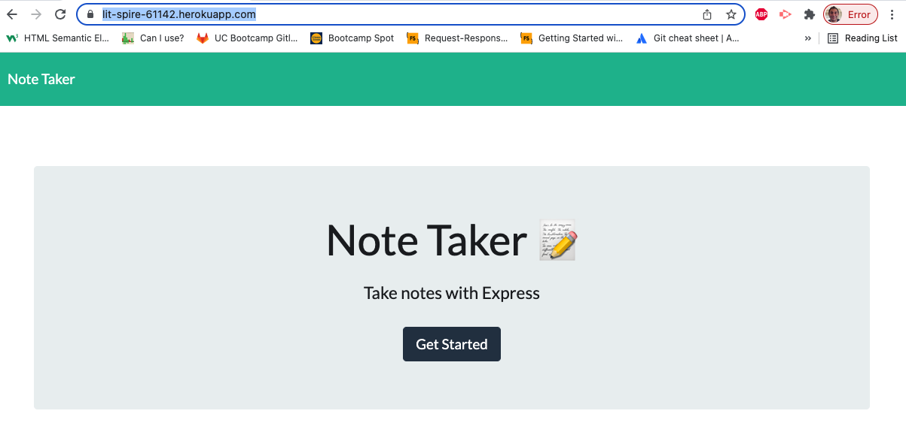
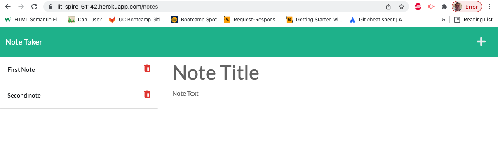
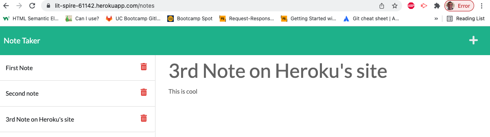

# Note Taker

## Overview
The `Note Taker` is Node.js based app that allows you to:
1. Create new notes
1. View existing notes
1. Delete notes
1. Edit notes *(not available yet)*

It uses `Express.js` for all API related calls. The live site can be accessed on `Heroku` at [https://lit-spire-61142.herokuapp.com/](https://lit-spire-61142.herokuapp.com/)

## Technologies Used:
- Javascript, Node.js
- `GET`, `POST`, `DELETE` API calls
- Express.js to handle API requests and response
- UUID package to generate unique IDs

## Screenshots




## User Story
```
AS A small business owner
I WANT to be able to write and save notes
SO THAT I can organize my thoughts and keep track of tasks I need to complete
```

## Acceptance Criteria
```
GIVEN a note-taking application
WHEN I open the Note Taker
THEN I am presented with a landing page with a link to a notes page
WHEN I click on the link to the notes page
THEN I am presented with a page with existing notes listed in the left-hand column, plus empty fields to enter a new note title and the note’s text in the right-hand column
WHEN I enter a new note title and the note’s text
THEN a Save icon appears in the navigation at the top of the page
WHEN I click on the Save icon
THEN the new note I have entered is saved and appears in the left-hand column with the other existing notes
WHEN I click on an existing note in the list in the left-hand column
THEN that note appears in the right-hand column
WHEN I click on the Write icon in the navigation at the top of the page
THEN I am presented with empty fields to enter a new note title and the note’s text in the right-hand column
```